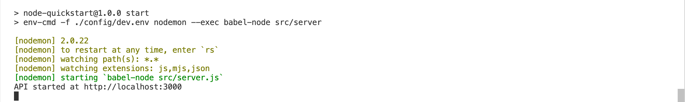
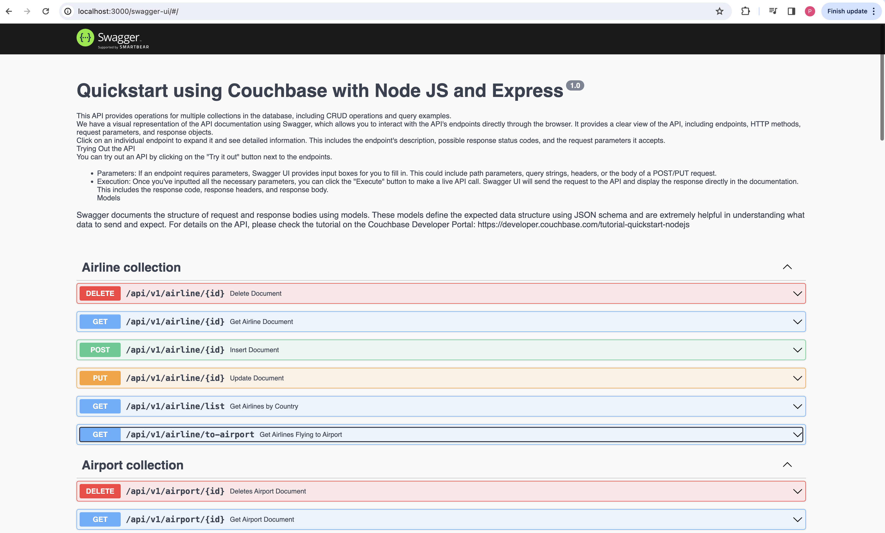
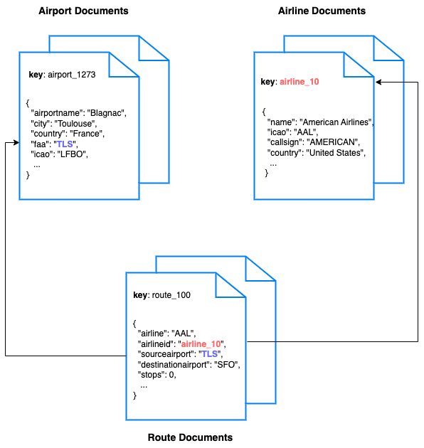

# Quickstart in Couchbase with Node JS and Express

#### Build a REST API with Node JS and Express

> This repo is designed to teach you how to connect to a Couchbase Capella cluster to create, read, update, and delete documents using [Key Value operations](https://docs.couchbase.com/nodejs-sdk/current/howtos/kv-operations.html) and how to write simple parametrized [SQL++ queries](https://docs.couchbase.com/nodejs-sdk/current/howtos/n1ql-queries-with-sdk.html) using the built-in travel-sample bucket. If you want to run this tutorial using a self managed Couchbase cluster, please refer to the [appendix](#appendix-running-self-managed-couchbase-cluster).


Full documentation can be found on the [Couchbase Developer Portal](https://developer.couchbase.com/tutorial-quickstart-golang-gin-gonic).

## Prerequisites

To run this prebuilt project, you will need:

- Couchbase Server (7 or higher) with [travel-sample](https://docs.couchbase.com/nodejs-sdk/current/ref/travel-app-data-model.html) bucket loaded.
  - [Couchbase Capella](https://www.couchbase.com/products/capella/) is the easiest way to get started.
- [Node js](https://nodejs.org/en/download) installed on local machine.
- Basic knowledge of [JavaScript](https://developer.mozilla.org/en-US/docs/Learn/Getting_started_with_the_web/JavaScript_basics), [Node JS](https://nodejs.org/en/learn/getting-started/introduction-to-nodejs) and [Express](https://expressjs.com/)


### Loading Travel Sample Bucket

If travel-sample is not loaded in your Capella cluster, you can load it by following the instructions for your Capella Cluster:

- [Load travel-sample bucket in Couchbase Capella](https://docs.couchbase.com/cloud/clusters/data-service/import-data-documents.html#import-sample-data)
## Install Dependencies

Any dependencies will be installed by running the npm install command, which installs any dependencies required for the project.

```sh
# Execute this command in the project's root directory
npm install
```

### Database Server Configuration

All configuration for communication with the database is read from the environment variables. We have provided a convenience feature in this quickstart to read the environment variables from a local file, `dev.env` in the `config` folder.

Add the values for the Couchbase connection.

To know more about connecting to your Capella cluster, please follow the [instructions](https://docs.couchbase.com/cloud/get-started/connect.html).

Specifically, you need to do the following:

- Create the [database credentials](https://docs.couchbase.com/cloud/clusters/manage-database-users.html) to access the travel-sample bucket (Read and Write) used in the application.
- [Allow access](https://docs.couchbase.com/cloud/clusters/allow-ip-address.html) to the Cluster from the IP on which the application is running.

```sh
DB_CONN_STR=<connection_string>
DB_USERNAME=<user_with_read_write_permission_to_travel-sample_bucket>
DB_PASSWORD=<password_for_user>
```

> Note: The connection string expects the `couchbases://` or `couchbase://` part.

## Running The Application

### Running directly on machine

At this point, we have installed the dependencies, loaded the travel-sample data and configured the application with the credentials. The application is now ready and you can run it.

The application will run on port 3000 of your local machine (http://localhost:3000). You will find the Swagger documentation of the API.

```sh
# Execute this command in the project's root directory
npm start
```

### Running using Docker

- Build the Docker image

```sh
# Execute this command in the project's root directory
docker build -t couchbase-node-express-js-quickstart .
```

- Run the Docker image

```sh
# Execute this command in the project's root directory
docker run -it --env-file config/dev.env -p 3000:3000 couchbase-node-express-js-quickstart
```

> Note: The `dev.env` file has the connection information to connect to your Capella cluster. These will be part of the environment variables in the Docker container.

### Checking the Application

Once the application starts, you can see the details of the application on the terminal.



The application will run on port 3000 of your local machine (http://localhost:3000). You will find the Swagger documentation of the API if you go to the URL in your browser.



### Using the Swagger Documentation

Swagger documentation provides a clear view of the API including endpoints, HTTP methods, request parameters, and response objects.

Click on an individual endpoint to expand it and see detailed information. This includes the endpoint's description, possible response status codes, and the request parameters it accepts.

#### Trying Out the API

You can try out an API by clicking on the "Try it out" button next to the endpoints.

- Parameters: If an endpoint requires parameters, Swagger UI provides input boxes for you to fill in. This could include path parameters, query strings, headers, or the body of a POST/PUT request.

- Execution: Once you've inputted all the necessary parameters, you can click the "Execute" button to make a live API call. Swagger UI will send the request to the API and display the response directly in the documentation. This includes the response code, response headers, and response body.

#### Models

Swagger documents the structure of request and response bodies using models. These models define the expected data structure using JSON schema and are extremely helpful in understanding what data to send and expect.
## Running The Tests

To run the standard tests, use the following commands:

```sh
# Execute this command in the project's root directory
npm test
```

## Appendix: Data Model

For this quickstart, we use three collections, `airport`, `airline` and `routes` that contain sample airports, airlines and airline routes respectively. The routes collection connects the airports and airlines as seen in the figure below. We use these connections in the quickstart to generate airports that are directly connected and airlines connecting to a destination airport. Note that these are just examples to highlight how you can use SQL++ queries to join the collections.



## Appendix: Running Self Managed Couchbase Cluster

If you are running this quickstart with a self managed Couchbase cluster, you need to [load](https://docs.couchbase.com/server/current/manage/manage-settings/install-sample-buckets.html) the travel-sample data bucket in your cluster and generate the credentials for the bucket by [creating a user](https://docs.couchbase.com/server/current/manage/manage-security/manage-users-and-roles.html#add-a-user).

You need to update the connection string and the credentials in the `dev.env` file in the `config` folder.

> Note: Couchbase Server must be installed and running prior to running this app.
